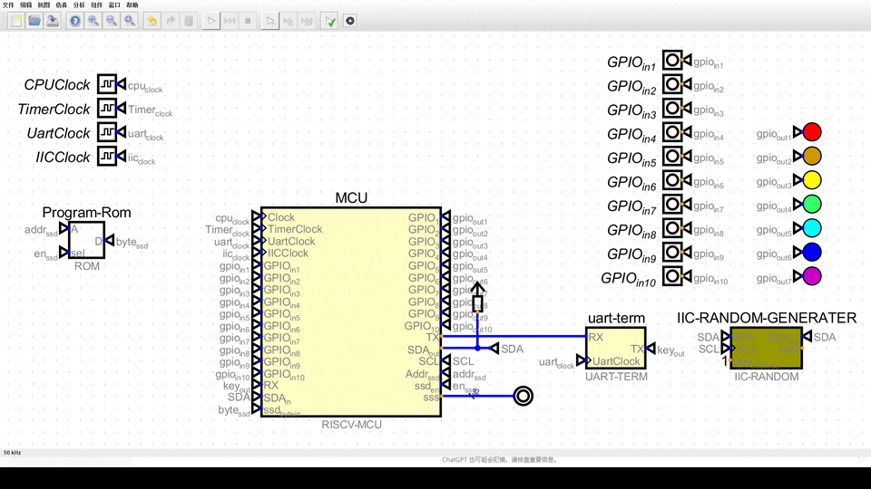
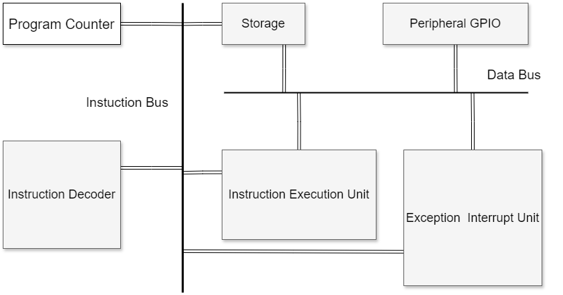
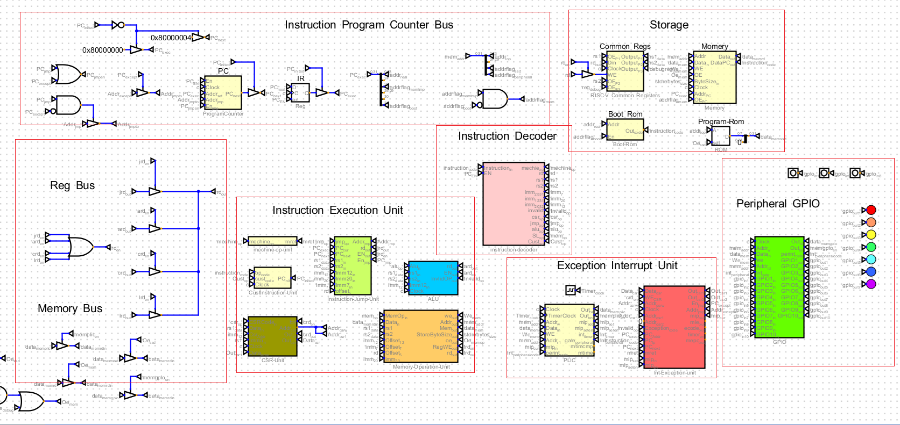
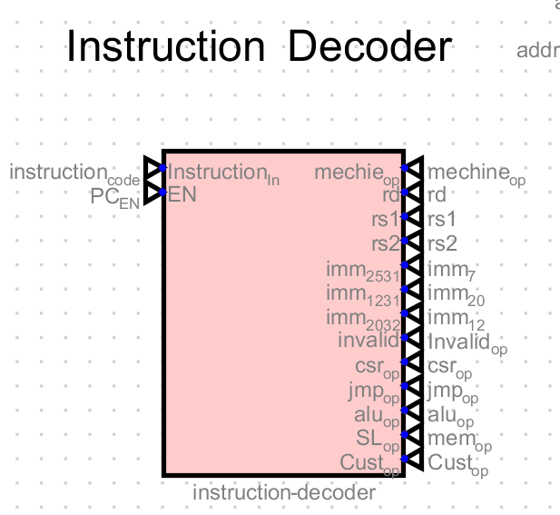
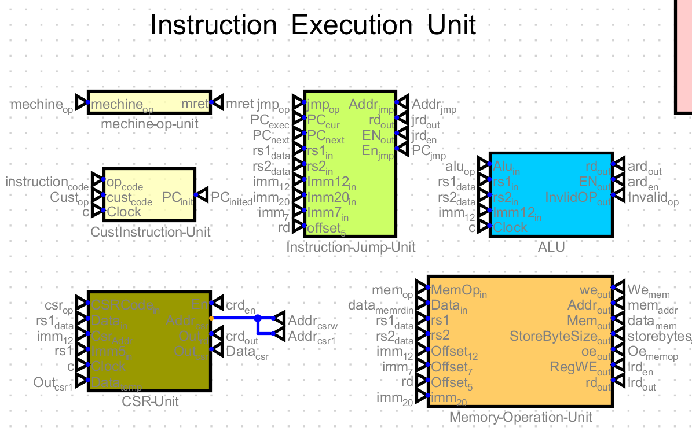
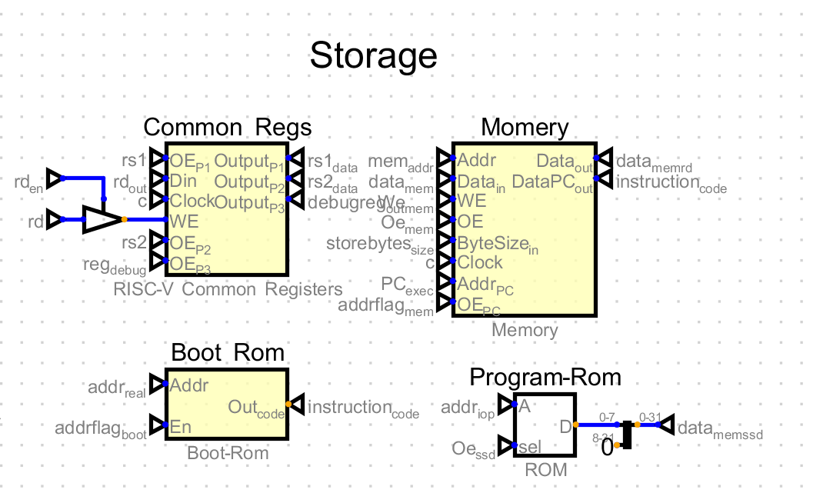
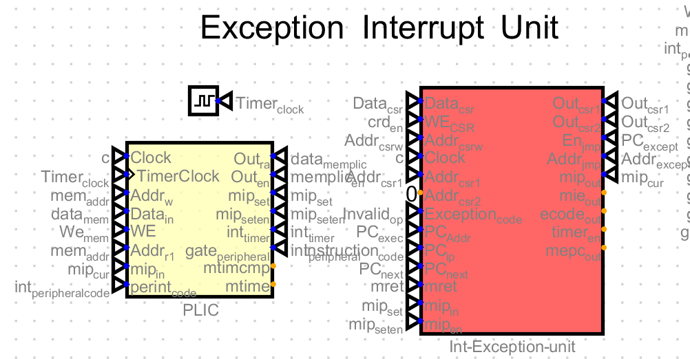
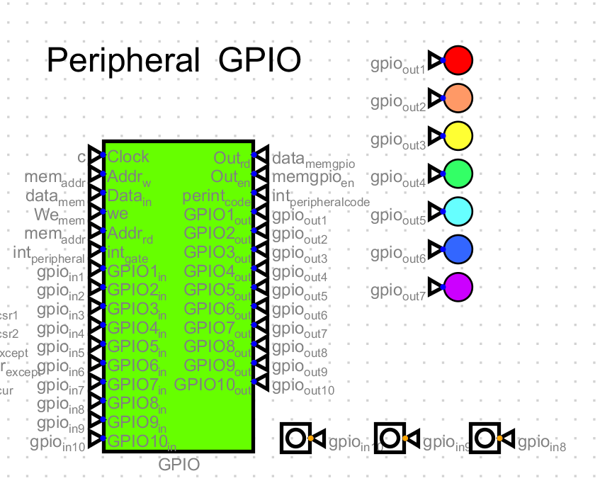
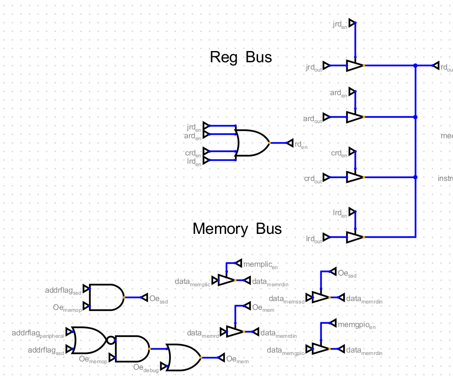
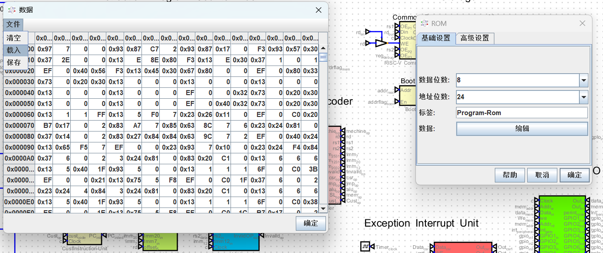

# riscv-mcu 
[中文](README_zh.md)

#### Introduction
This project utilizes the Digital digital circuit simulation software [Download link](https://github.com/hneemann/Digital),to build a CPU that supports a simple instruction set and simple peripheral circuit simulation.   
The goal is to support system boot, startup, operation, interrupt handling, peripheral control, and other functions.

This project is intended to assist in learning CPU structure/digital circuit design, microcomputer composition principles, assembly/C language development, embedded development, and other introductory technologies.  

the current project supports the complete RISCV32I ISA and some peripheral circuits, such as timers and GPIOs. With the goal of entry-level learning, the current project only supports a single-pipeline CPU and does not adopt multi-level pipeline and cache technologies. All instructions are designed to execute in a single cycle without features like instruction out-of-order and multi-level dispatch.

The project supports the writing of boot and firmwares in risc-v assembly and C language, simulation and operation through the Digital software.

RISC-V is a currently active open-source instruction set. For more information, please refer to [RISC-V](https://riscv.org/)。

#### Installation 
1.  Download the Digital software [Digital](https://github.com/hneemann/Digital)
2.  Download the code for this project
    ```
    git clone https://gitee.com/virtual-computer/cpu-v.git
    ```
3.  Open the Digital, click on File-Open, and select the risc-v-computer.dig file in the digital directory of the project.
4.  Click the run simulation button.

#### preview


After the simulation starts, the boot program is loaded first. The boot program is stored in the boot-rom, and the boot program loads the firmware from the program-rom into memory and then jumps to the firmware entry address to start executing the firmware.

The example firmware controls the LED light through GPIO, controls the blinking of the LED light through a timer, and uses hardware interrupts to detect GPIO input and change the blinking mode of the LED light.

#### Hardware Architecture
The overall system includes modules such as instruction fetch bus, instruction decoder, instruction execution unit, memory, exception interrupt handling unit, peripheral modules, and internal data bus.  





* Instruction Fetch Bus
  > Includes instruction initial address, address register (PC), instruction register (IR), and instruction memory access selection.   
    The initial instruction is loaded from the fixed address of 0x80000000, which is the address of the first instruction after system power-on. The system boot program also starts execution from this address.  
    The address register (PC) stores the address of the current instruction and calculates the address of the next instruction. In this system, the instruction address is fixed and aligned to 4 bytes, so the address of the next instruction is PC+4. At the same time, PC is directly connected to the jump instruction execution unit and the exception interrupt handling unit. If the current instruction is a jump instruction or there are exceptions or interrupts to be processed, the address of the next instruction can be modified directly, thus achieving single-cycle execution and avoiding processes such as instruction prediction and pipeline flushing.    
    The instruction register (IR) stores the current instruction. The address of the current instruction is obtained from the correct ROM or RAM through the instruction memory access selection circuit, and the instruction code is then passed to the instruction decoder for decoding.  
    The instruction memory access selection is a series of selection circuits. The instruction address is judged by the high-order bytes of the instruction address. In this system, there are only two starting addresses for the instruction address: 0x80000000 and 0x02000000. If the high-order byte is 0x80, the instruction is obtained from the boot-rom; if the high-order byte is 0x02, the instruction is obtained from the RAM.  

* Instruction Decoder
    

  > Includes the instruction decoder (ID) that supports RISCV32I integer basic instruction set decoding, supports 50 instructions, and has a 32-bit instruction code input circuit. After parsing, it outputs logical and computational instructions, jump instructions, csr access instructions, memory load/write instructions, machine mode instructions, and custom instructions. It is connected to each corresponding instruction execution unit, and the specific instruction information is represented by different data line levels. At the same time, it pre-builds the I R S J U B instruction format field data parsing and leads out data connections. The subsequent execution unit can directly read.

* Instruction Execution Unit
    

  > ALU logical and computational unit, implements and/or/add/sub/slli instructions.  
    Jump instruction unit, implements jal/bne instructions.  
    CSR access instruction unit, implements csrrw/csrrs/csrrc/csrrwi/csrrsi/csrrci instructions.  
    Memory load/write instruction unit, implements lw/sw instructions.  
    Machine mode instruction unit, implements mret instructions.  
    Custom instruction unit, currently only implements one instruction 0x8000007F, used to implement the conversion from boot mode to normal execution mode.  

* Storage
    
  
  > General-purpose registers, implement 32 general-purpose registers x0 ~ x31. 
    Memory module, implements 32-bit wide memory, supports read and write operations, and implements non-aligned byte operations through 4-block selection combinations. It can implement any read and write instructions of 4 bytes and below in a single cycle.  
    Boot-rom, implements 32-bit wide ROM, supports read operations, and is used to store the boot program. It supports 32-bit alignment and does not support byte operations.  
    Program-ram, implements 8-bit wide RAM, supports read operations, and supports byte reads. When the boot program loads the firmware into memory, it can only be loaded by bytes.  

* Exception Interrupt Handling Unit
    

  > PLIC implements a timer interrupt source, a custom clock, and provides a unified hardware peripheral interrupt management.  
    The exception interrupt handling module implements exception interrupt handling, including exception code, exception type, interrupt type, interrupt number, interrupt priority, interrupt enable, interrupt trigger, interrupt mask, interrupt pending, and interrupt return address signals. Exceptions have the highest priority, followed by hardware interrupts, software interrupts, and clock interrupts in priority order. Nested interrupts are not supported.

* Peripherals
    

  > GPIO implements a hardware peripheral with 10 gpio ports, supports input/output mode configuration, and supports input hardware interrupt triggering.

* Internal Data Bus
  

  > Includes the data transmission bus between the instruction fetch bus, instruction decoder, instruction execution unit, memory, exception interrupt handling unit, peripheral modules, and other modules.

#### Software Programs
  The software programs consist of two parts: the boot program and the application program.  
  * Boot Program
    > The boot program is used to load the firmware into memory and jump to the firmware entry address to start execution.  
    The boot program is stored in the boot-rom. The boot program loads the user firmware from the program-rom into memory and then jumps to the firmware entry address to start executing the firmware.  
    The boot program is written in risc-v assembly language. For details, please refer to the `src/boot.s` file.

  * Firmware
    > The firmware starts with start.s, sets up interrupt handling functions and configurations in `start.s`, and then jumps to the C language main function to start execution.  
    In the `src/bsp` directory, corresponding code encapsulation for operations such as gpio, timer, and interrupts is provided for easy calling in C language.  
    In the `src/main.c` file, a simple user program is implemented by calling the code in bsp, controlling the LED light through GPIO, controlling the blinking of the LED light through a timer, and detecting GPIO input through hardware interrupts to change the blinking mode of the LED light. The code includes a version with a sleep delay implementation and a version with interrupt implementation. The application program is written in C language. For details, please refer to the `src/main.c` file.  
      ```c
        #include "gpio.h"
        #include "timer.h"
        #include "interrupt.h"

        static int mode = 0;

        void flash_by_sleep() {
            // set low 7 pins of port D as output
            set_all_pins_mode(0x7f);
            for(;;) {
                mode = get_pin(10);
                if(mode) {
                    set_all_pins(get_all_pins() | 0x7f);
                    sleep(500);
                    set_all_pins(get_all_pins() & ~0x7f);
                    sleep(500);
                } else {
                    for(int i=1;i<8 && mode==0;i++) {
                        set_pin(i, 1);
                        sleep(500);
                        set_pin(i, 0);
                    }
                }
            }
        }

        static int cur_pin = 0;
        static int cur_pins_status = 0;

        void flash_timer_handler() {
            // set low 7 pins of port D as output
            set_all_pins_mode(0x7f);
            if(mode) {
                if(cur_pins_status) {
                    set_all_pins(get_all_pins() & ~0x7f);
                    cur_pins_status = 0;
                }else{
                    set_all_pins(get_all_pins() | 0x7f);
                    cur_pins_status = 1;
                }
            } else {
                set_all_pins(get_all_pins() & ~0x7f);
                cur_pin++;
                if(cur_pin > 7) {
                    cur_pin = 1;
                }
                set_pin(cur_pin, 1);
            }
            add_soft_timer(500, flash_timer_handler);
        }

        void mode_change_handler() {
            mode = get_pin(10);
            clear_gpio_int();
        }

        void flash_by_interrupt() {
            init_global_timer();
            add_soft_timer(500, flash_timer_handler);
            register_peripheral_int_handler(INT_GPIO,mode_change_handler);
            for(;;) {}
        }

        int main() {
            // flash_by_sleep();
            flash_by_interrupt();
            return 0;
        }
          ```

#### Software Compilation
  The boot and application programs need to be compiled using the risc-v cross-compilation toolchain [riscv-gnu-toolchain](https://github.com/riscv-collab/riscv-gnu-toolchain)  

  > Since this project only supports a 32-bit instruction set, params needs to be specified during compilation.  

  ```
        ./configure --prefix=/opt/riscv --with-arch=rv32gc --with-abi=ilp32d     
        make linux 
  ```

  After the toolchain is compiled, add the bin directory to the system PATH. Then, you can execute make in the src directory to compile.    

  ```
      export PATH=$PATH:/opt/riscv/bin  
      cd src  
      make  
  ```  

  After compilation, the generated boot.bin and kernel.bin are the boot program and user program, respectively. In the Digital tool, the compiled byte hex text needs to be imported into the program-rom.     
  You can execute `python3 ./mkhex.py` in the src directory to generate a hex file.  

  ```
      cd src
      python3 ./mkhex.py
  ```
  
  The generated kernel.hex can be imported into the program-rom in the Digital tool.  

  
