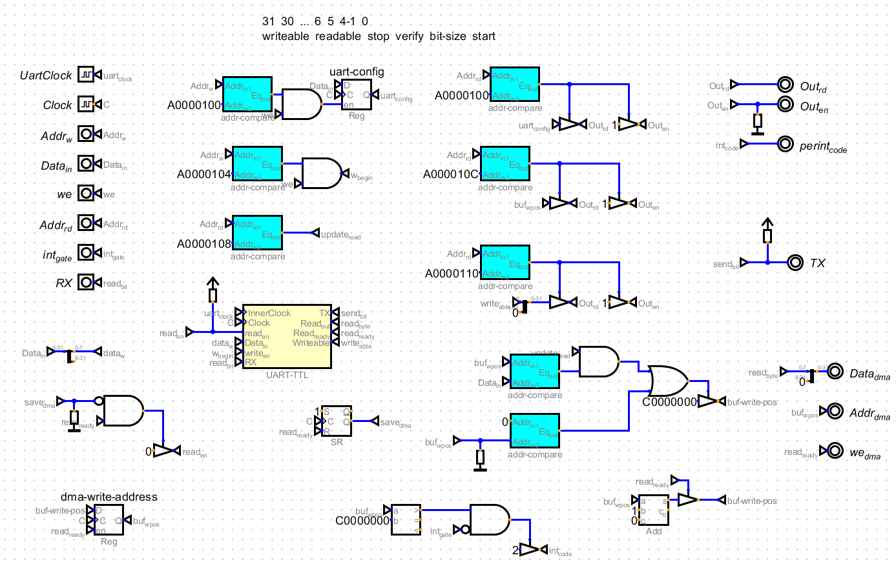
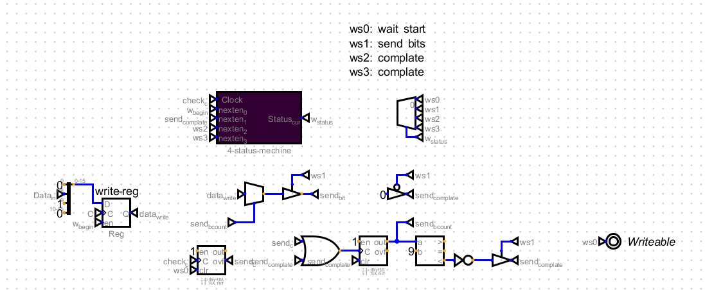
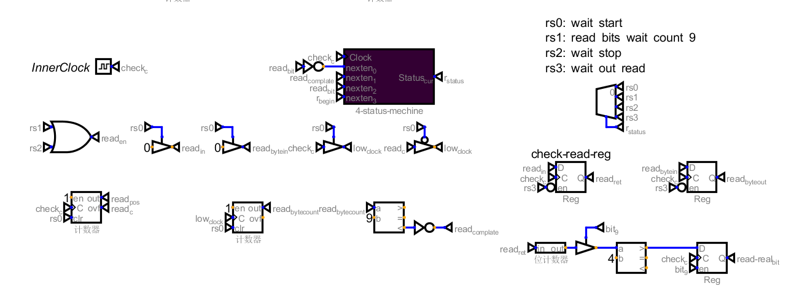
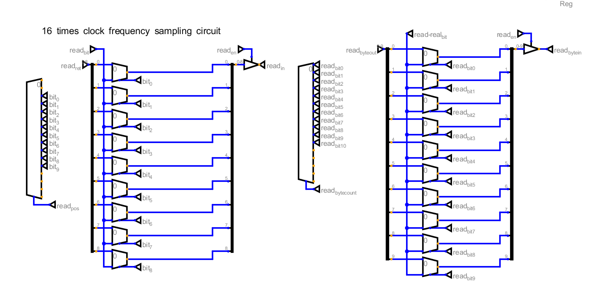
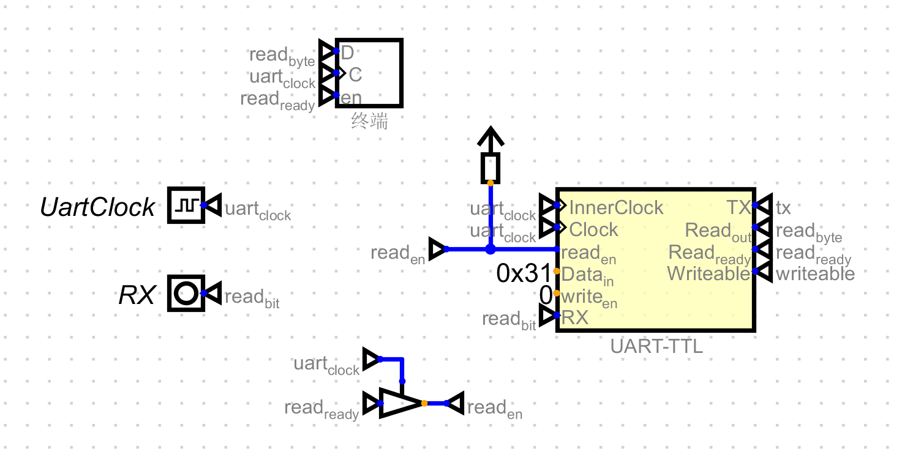

# UART 串口通信

## 1. 简介

UART（Universal Asynchronous Receiver/Transmitter，通用异步收发传输器）是一种串行通信协议，用于在微控制器和其他设备之间传输数据。UART 通信使用串行数据线（TX）和串行接收线（RX）进行数据传输，通过设置波特率、数据位、停止位和校验位等参数来控制通信速率和数据格式。

## 2. 硬件实现


1. UART控制器
](image/uart-controller.png)
 > 通过UART-TTL模块实现串口数据的收发，模块具体实现见后文。  

 控制器内存映射地址及用途如下：  
 >  | 地址 | 大小 | 用途 |   
    | ---- | ---- | ---- |  
    | 0xA0000100 | 4B | 串口配置寄存器，配置波特率、起始位、校验位、停止位等信息（硬件暂未实现） |  
    | 0xA0000104 | 1B | 串口字节发送地址，通过将字节写入本地址将串口数据发送给外设 |  
    | 0xA0000108 | 4B | 串口读取位置地址写入，通知控制器已经读取的缓存区位置，用于缓存区释放和中断取消 | 
    | 0xA000010C | 4B | 串口接收到的数据缓存区末尾地址，读取时可以判断是否读取完毕，缓存区使用了DMA，所以程序中可以直接读取内存 |
    | 0xA0000110 | 4B | 串口控制器状态获取，目前只有最低位有效，为1时可以写入，为0时表示正在发送数据 | 
    发送部分TX和发送使能，分别与外部CPU进行接线，发送数据宽度8bits。  
    接受部分，在接收到数据后，会自动写入DMA，从0xC0000000基地址开始写入，并发送中断信号给PLIC控制器。 


2. UART-TTL模块

 > UART-TTL模块发送部分，通过一个状态机实现。发送部分比较简单,分为三个状态：等待发送、发送、发送完成。  
   待发送的字节数据通过添加起始位和停止位，然后通过串口发送出去。  
   通过一个计数器将时钟进行分频，分频后按照顺序发送数据位。  



 > UART-TTL模块接受部分，通过一个状态机实现。串口接收的部分比较复杂，分为4个状态：等待开始、接受、等待停止、等待写入缓存。  
   利用分频的时钟，实现16倍的采样电路，通过采样投票来实现数据位确定，避免串口通信中的抖动问题。（在仿真中只是演示过程，实际仿真中不会出现抖动杂波）

2. 串口中断外设
  
 > 通过UART-TTL模块接受串口字符，并显示到终端字符屏幕上，可以用作整个mcu系统的输出。

## 3. 软件实现

在bsp目录下增加uart封装，主要实现了三个接口：
send_data、read_data、send_string，分别用于发送数据、读取数据、发送字符串。

```c
#ifndef UART_H
#define UART_H

#include "types.h"

// Set baud rate, start bit, stop bit and other communication configurations
// note: this is reserved for future use
#define UART_CONFIG_ADDR 0xA0000100
// Write data to the UART
#define UART_WRITE_ADDR 0xA0000104
// after read data from the UART, set current read address for clear interupt
#define UART_SET_READEND_ADDR 0xA0000108
// current data bufer end address
#define UART_CUR_BUFEND_ADDR 0xA000010C
// get uart current status bit 0 writeable other bits reserved (read only)
#define UART_STATUS_ADDR 0xA0000110
// data buffer start address
#define UART_DMA_BASE 0xC0000000


void send_data(uint8_t *data, uint32_t len);
uint32_t read_data(uint8_t *data, uint32_t len);

void send_string(const char *str);

#endif
```

在示例程序中，在之前的gpio控制基础上，每次led切换和控制模式切换，增加了串口日志打印：
```c
void flash_timer_handler() {
    ...
    send_string("led status changed\n");
    add_soft_timer(500, flash_timer_handler);
}

void mode_change_handler() {
    mode = get_pin(10);
    clear_gpio_int();
    send_string("led flash mode changed\n");
}
```

## 4. 运行效果

